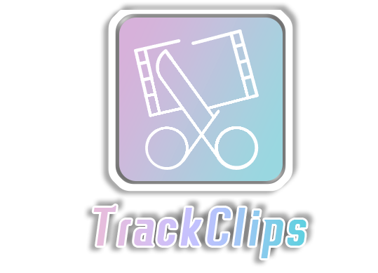
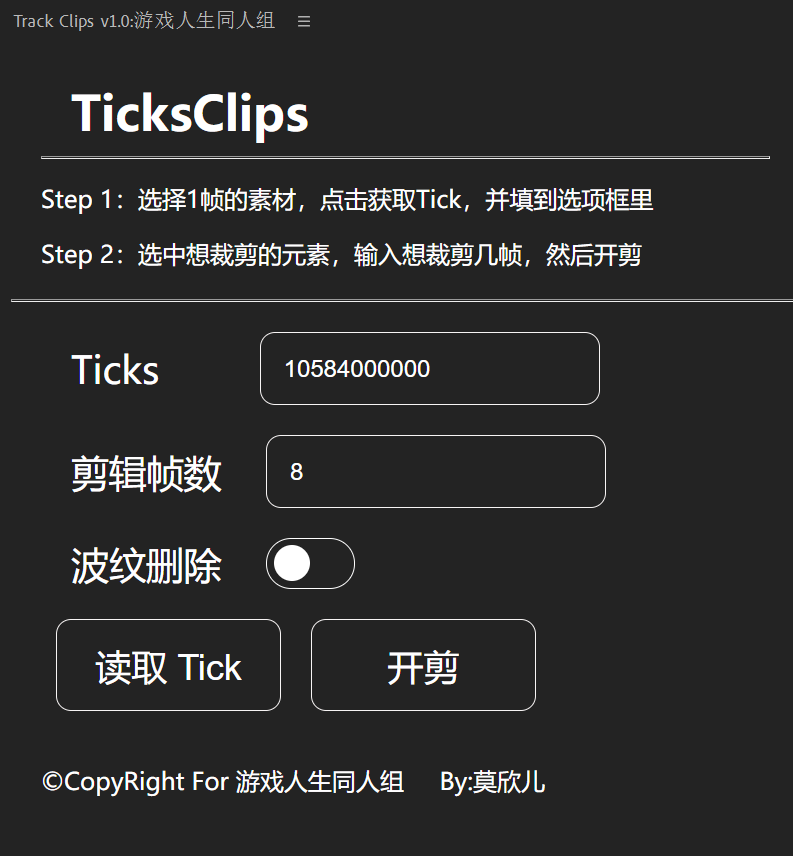

# TackClips
一个简单的批量剪前置帧的 **Adobe Premiere Pro** 插件



## 🎁 TrackClips 是什么 
### 这是一个可以批量剪辑去除分镜信息帧的插件



## 🏆 TrackClips 功能
## 功能描述
* TrackClips 的功能非常简单！

* 如果你是一位动画师，你应该会在每一分镜的前几帧插入该分镜的内容信息吧！
* 这个插件就可以批量去除所有的分镜信息帧！


## 功能演示
https://github.com/Moxiner/TrackClips/assets/87905048/4f9ef61a-5cce-40ed-8ae5-aa396dbfa597


## 🪛 安装说明
#### 【Step 1】下载 ```com.moxiner.clips```
* 请 👉[点击此处](https://github.com/Moxiner/TrackClips/releases)👈 下载 ```TrackClips.zip```
#### 【Step 2】安装 TrackClips
* 解压插件包
* 拷贝 ```com.moxiner.clips``` 文件夹到以下位置:


```
Win : C:\Program Files (x86)\Common Files\Adobe\CEP\extensions\
Mac : 系统盘/Library（中文叫资源库）/Application Support/Adobe/CEP/extensions
```
#### 【Step 3】打开调试模式
因为我没有把该插件签名打包，使用该插件需要开启调试模式
* 请 👉[点击此处](https://github.com/Moxiner/TrackClips/releases)👈 下载 ```Debug.zip```

``` 
Windows：运行一下 Add Keys.reg
Mac：运行一下 install-as-admin
```

#### 【Step 4】完成
* 在 **Adobe Premiere Pro**主界面 ```窗口 👉 拓展 👉 TrackClips``` 中打开
## 🎬 使用方法

#### 【Step 1】获取  ```Tick``` 
* 打开要使用的序列
* 选中 **1帧** 的素材
* 点击 **获取Tick**
* 将获取的 **Tick** 填写到 **Tick输入框** 中
#### 【Step 2】裁剪 分镜信息帧
* 选中要裁剪的素材
* 在 **剪辑帧数输入框** 输入你想裁剪的帧数
* **开剪**
  
## ✨ FQA
| 问题 | 回答 |
|------|------|
|Q： ```Tick``` 是什么？|A：Pr内部的时间单位和帧速率有关，类似于时间戳？|
|Q：我为什么要先获取 ```Tick``` ？|A： ```Tick``` 和帧速率有关，不同规格（帧速率）的序列每帧的 ```Tick``` 也不一样，如果没调或调错会出现大问题|
|Q：我为什么安装之后会有警告？|A：因为没有签名，无视即可|
|Q：为什么不签名打包？|A：不会|

## 📑 版权许可


* 您需遵守 GPL 3.0 许可协议，同时需额外遵循以下补充要求
* 本项目仅供参考学习，**莫欣儿** 不会对您使用本项目产生的任何后果负责
* 本项目为开源项目，项目及其衍生项目不得商用
* 本项目可以转载，但请联系 **莫欣儿** 授权（无特殊情况一定会授权的！(●ˇ∀ˇ●)）并在明显地方标明由此出处
* 有什么问题、建议、反馈 ，请提交至 👉[GitHub Issues](https://github.com/Moxiner/TrackClips/issues)👈 \\(≧∇≦)ﾉ

## 🎭 参与开发人员&鸣谢名单

|       |  
| :------------------------------------------------------------------:  | 
|              [@Moxiner](https://github.com/Moxiner)                    |                                    

___Copyright © 2024 Moxiner And NGNLFan_Teams(or Moxiner). All Rights Reserved.___
